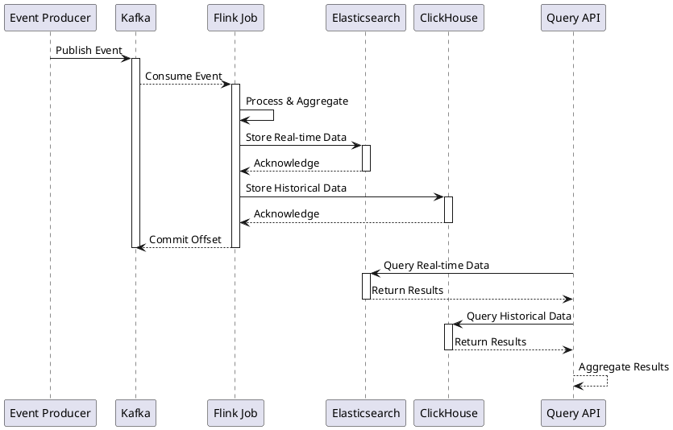
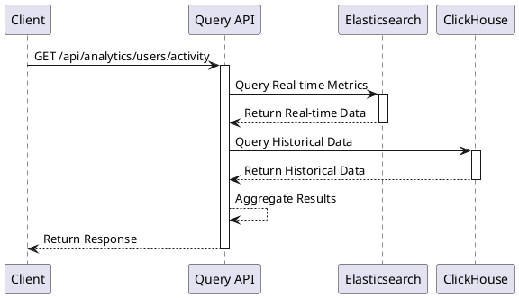

# Analytics Engine Architecture Details

## 1. Sequence Diagrams

### 1.1 Event Processing Flow


### 1.2 Analytics Query Flow


## 2. Database Schemas

### 2.1 ClickHouse Tables

#### 2.1.1 Events Table
```sql
CREATE TABLE events
(
    id String,
    type String,
    timestamp DateTime,
    data String,
    metadata String,
    created_at DateTime DEFAULT now()
)
ENGINE = MergeTree()
PARTITION BY toYYYYMM(timestamp)
ORDER BY (type, timestamp);
```

#### 2.1.2 User Analytics Table
```sql
CREATE TABLE user_analytics
(
    user_id String,
    event_type String,
    timestamp DateTime,
    metrics Map(String, Float64),
    dimensions Map(String, String),
    created_at DateTime DEFAULT now()
)
ENGINE = MergeTree()
PARTITION BY toYYYYMM(timestamp)
ORDER BY (user_id, event_type, timestamp);
```

#### 2.1.3 Product Analytics Table
```sql
CREATE TABLE product_analytics
(
    product_id String,
    event_type String,
    timestamp DateTime,
    metrics Map(String, Float64),
    dimensions Map(String, String),
    created_at DateTime DEFAULT now()
)
ENGINE = MergeTree()
PARTITION BY toYYYYMM(timestamp)
ORDER BY (product_id, event_type, timestamp);
```

### 2.2 Elasticsearch Indices

#### 2.2.1 Real-time Events Index
```json
{
  "settings": {
    "number_of_shards": 3,
    "number_of_replicas": 2,
    "refresh_interval": "1s"
  },
  "mappings": {
    "properties": {
      "id": { "type": "keyword" },
      "type": { "type": "keyword" },
      "timestamp": { "type": "date" },
      "data": { "type": "object" },
      "metadata": { "type": "object" },
      "created_at": { "type": "date" }
    }
  }
}
```

#### 2.2.2 User Analytics Index
```json
{
  "settings": {
    "number_of_shards": 3,
    "number_of_replicas": 2,
    "refresh_interval": "1s"
  },
  "mappings": {
    "properties": {
      "user_id": { "type": "keyword" },
      "event_type": { "type": "keyword" },
      "timestamp": { "type": "date" },
      "metrics": {
        "type": "object",
        "properties": {
          "engagement_score": { "type": "float" },
          "session_duration": { "type": "long" },
          "event_count": { "type": "integer" }
        }
      },
      "dimensions": {
        "type": "object",
        "properties": {
          "device_type": { "type": "keyword" },
          "location": { "type": "geo_point" },
          "user_segment": { "type": "keyword" }
        }
      }
    }
  }
}
```

#### 2.2.3 Product Analytics Index
```json
{
  "settings": {
    "number_of_shards": 3,
    "number_of_replicas": 2,
    "refresh_interval": "1s"
  },
  "mappings": {
    "properties": {
      "product_id": { "type": "keyword" },
      "event_type": { "type": "keyword" },
      "timestamp": { "type": "date" },
      "metrics": {
        "type": "object",
        "properties": {
          "view_count": { "type": "integer" },
          "conversion_rate": { "type": "float" },
          "revenue": { "type": "float" }
        }
      },
      "dimensions": {
        "type": "object",
        "properties": {
          "category": { "type": "keyword" },
          "price_range": { "type": "keyword" },
          "availability": { "type": "keyword" }
        }
      }
    }
  }
}
```

## 3. Kafka Topics

### 3.1 Topic Configurations
```properties
# User Events Topic
num.partitions=3
replication.factor=2
retention.ms=604800000
cleanup.policy=delete
segment.bytes=1073741824

# Product Events Topic
num.partitions=3
replication.factor=2
retention.ms=604800000
cleanup.policy=delete
segment.bytes=1073741824

# Order Events Topic
num.partitions=3
replication.factor=2
retention.ms=604800000
cleanup.policy=delete
segment.bytes=1073741824
```

## 4. Flink Job Configuration

### 4.1 Job Properties
```properties
# Checkpointing
state.backend=filesystem
state.checkpoints.dir=hdfs:///flink/checkpoints
execution.checkpointing.interval=300000
execution.checkpointing.timeout=600000

# State Management
state.backend.incremental=true
state.backend.local-recovery=true

# Processing
pipeline.name=Analytics Engine
execution.runtime-mode=STREAMING
execution.parallelism.default=3
```

## 5. System Configuration

### 5.1 Resource Allocation
```yaml
# Flink JobManager
jobmanager.memory.process.size: 1600m
jobmanager.memory.jvm-metaspace.size: 256m
jobmanager.memory.jvm-overhead.min: 128m
jobmanager.memory.jvm-overhead.max: 512m

# Flink TaskManager
taskmanager.memory.process.size: 4096m
taskmanager.memory.framework.off-heap.size: 128m
taskmanager.memory.task.off-heap.size: 128m
taskmanager.memory.network.min: 64m
taskmanager.memory.network.max: 512m

# Elasticsearch
ES_JAVA_OPTS="-Xms2g -Xmx2g"
indices.memory.index_buffer_size=30%

# ClickHouse
max_memory_usage=8G
max_memory_usage_for_user=7G
```

### 5.2 Monitoring Configuration
```yaml
# Prometheus Metrics
metrics.reporter.prom.class: org.apache.flink.metrics.prometheus.PrometheusReporter
metrics.reporter.prom.port: 9249

# Logging
logging.level.root: INFO
logging.level.com.poc.analytics: DEBUG
logging.pattern.console: "%d{yyyy-MM-dd HH:mm:ss.SSS} [%thread] %-5level %logger{36} - %msg%n"
``` 